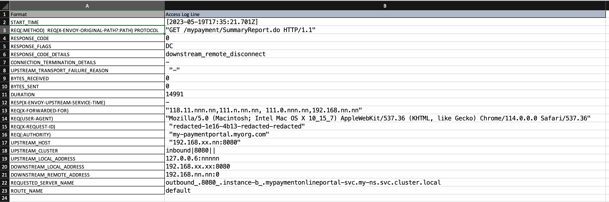

### Usage

- Open the input.txt and paste the Access Log line
- Run the script

```bash
./extract-envoy-access-log-info.sh
```

- Paste the output in the spreadsheet for better readability. 

- Here is how it would look:



### Links
- [Access log format](https://istio.io/latest/docs/tasks/observability/logs/access-log/#default-access-log-format)
- [Access log values explanation](https://www.envoyproxy.io/docs/envoy/latest/configuration/observability/access_log/usage)


### Usage Example
```bash
./extract-envoy-access-log-info.sh
```

```bash
[2023-05-19T17:35:21.701Z]
"GET /mypayment/SummaryReport.do HTTP/1.1"
0
DC
downstream_remote_disconnect
-
 "-"
0
0
14991
-
"118.11.nnn.nn,111.n.nn.nn, 111.0.nnn.nn,192.168.nn.nn"
"Mozilla/5.0 (Macintosh; Intel Mac OS X 10_15_7) AppleWebKit/537.36 (KHTML, like Gecko) Chrome/114.0.0.0 Safari/537.36"
 "redacted-1e16-4b13-redacted-redacted"
 "my-paymentportal.myorg.com"
 "192.168.xx.nn:8080"
inbound|8080||
127.0.0.6:nnnnn
192.168.xx.xx:8080
192.168.nn.nn:0
outbound_.8080_.instance-b_.mypaymentonlineportal-svc.my-ns.svc.cluster.local
default
```

