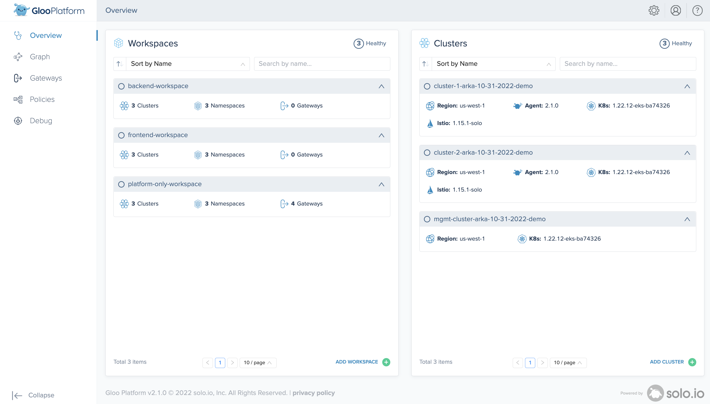
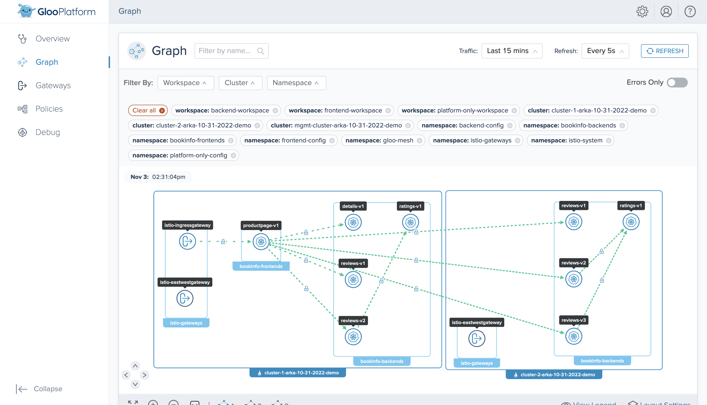
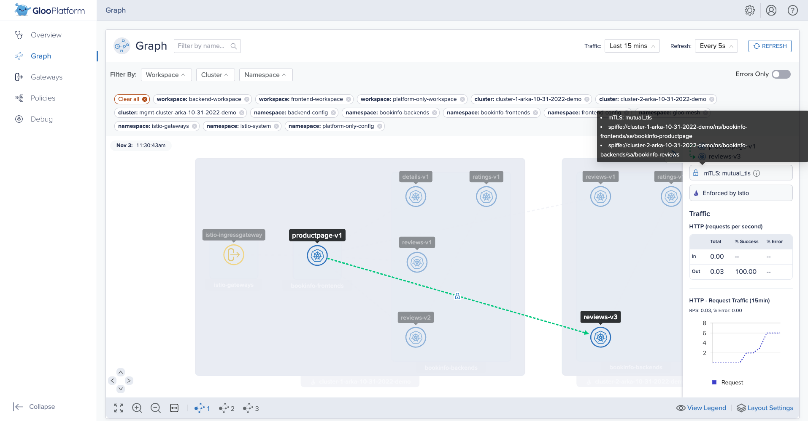
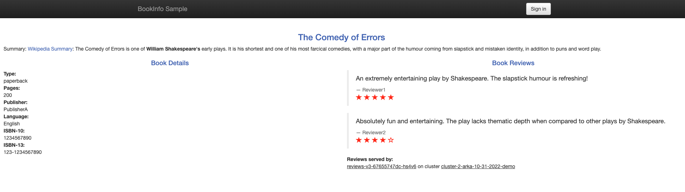

> The following example configuration notes are created based on the [blog](https://github.com/solo-io/solo-cop/tree/main/blogs/workspaces) in the Solo Community of Practices repository.

## `Workspace` & `WorkspaceSettings` objects

1. platform-only-workspace
2. frontend-workspace
3. backend-workspace

## Corresponding Namespaces

### Within `platform-only-workspace`
- platform-only-config (Would contain Gloo Mesh configuration files i.e. `WorkspaceSettings/VirtualGateways/RouteTables/Policies` etc.)
- istio-gateways
- gloo-mesh-addons

### Within `frontend-workspace`
- frontend-config (Would contain Gloo Mesh configuration files i.e. `WorkspaceSettings/VirtualGateways/RouteTables/Policies` etc.)
- bookinfo-frontends

### Within `backend-workspace`
- backend-config (Would contain Gloo Mesh configuration files i.e. `WorkspaceSettings/VirtualGateways/RouteTables/Policies` etc.)
- bookinfo-backends

## Create Workspaces

### platform-only-workspace
```bash
kubectl --context ${MGMT_CONTEXT} create namespace "platform-only-config";

kubectl apply --context ${MGMT_CONTEXT} -f- <<EOF
apiVersion: admin.gloo.solo.io/v2
kind: Workspace
metadata:
  name: platform-only-workspace
  namespace: gloo-mesh
spec:
  workloadClusters:
  - name: ${MGMT_CLUSTER}
    namespaces:
    - name: platform-only-config
    configEnabled: true
  - name: '*'
    namespaces:
    - name: 'istio-gateways'
    - name: 'gloo-mesh-addons'
    configEnabled: false
EOF
```

### frontend-workspace
```bash
kubectl --context ${MGMT_CONTEXT} create namespace "frontend-config";

kubectl apply --context ${MGMT_CONTEXT} -f- <<EOF
apiVersion: admin.gloo.solo.io/v2
kind: Workspace
metadata:
  name: frontend-workspace
  namespace: gloo-mesh
spec:
  workloadClusters:
  - name: ${MGMT_CLUSTER}
    namespaces:
    - name: frontend-config
    configEnabled: true
  - name: '*'
    namespaces:
    - name: 'bookinfo-frontends'
    configEnabled: false
EOF
```

### backend-workspace
```bash
kubectl --context ${MGMT_CONTEXT} create namespace "backend-config";
kubectl apply --context ${MGMT_CONTEXT} -f- <<EOF
apiVersion: admin.gloo.solo.io/v2
kind: Workspace
metadata:
  name: backend-workspace
  namespace: gloo-mesh
spec:
  workloadClusters:
  - name: ${MGMT_CLUSTER}
    namespaces:
    - name: backend-config
    configEnabled: true
  - name: '*'
    namespaces:
    - name: 'bookinfo-backends'
    configEnabled: false
EOF
```

## Create WorkspaceSettings

### platform-only-workspace
```bash
kubectl apply --context ${MGMT_CONTEXT} -f- <<EOF
apiVersion: admin.gloo.solo.io/v2
kind: WorkspaceSettings
metadata:
  name: platform-only-workspace
  namespace: platform-only-config
spec:
  importFrom:
  - workspaces:
    - name: frontend-workspace
  exportTo:
  - workspaces:
    - name: "*"
    resources:
    - kind: SERVICE
      namespace: gloo-mesh-addons
    - kind: VIRTUAL_DESTINATION
      namespace: gloo-mesh-addons
  options:
    federation:
      enabled: false
    eastWestGateways:
    - selector:
        labels:
          istio: eastwestgateway
    serviceIsolation:
      enabled: true
      trimProxyConfig: true
EOF
```

### frontend-workspace
```bash
kubectl apply --context ${MGMT_CONTEXT} -f- <<EOF
apiVersion: admin.gloo.solo.io/v2
kind: WorkspaceSettings
metadata:
  name: frontend-workspace
  namespace: frontend-config
spec:
  importFrom:
  - workspaces:
    - name: backend-workspace
  - workspaces:
    - name: platform-only-workspace    # in case we decide to use the Services from addons ext auth etc.
  exportTo:
  - workspaces:
    - name: platform-only-workspace
  options:
    eastWestGateways:
    - selector:
        labels:
          istio: eastwestgateway
    federation:
      enabled: false
    serviceIsolation:
      enabled: true
      trimProxyConfig: true
EOF
```

### backend-workspace
```bash
kubectl apply --context ${MGMT_CONTEXT} -f- <<EOF
apiVersion: admin.gloo.solo.io/v2
kind: WorkspaceSettings
metadata:
  name: backend-workspace
  namespace: backend-config
spec:
  exportTo:
  - workspaces:
    - name: frontend-workspace
  importFrom:
  - workspaces:
    - name: platform-only-workspace    # in case we decide to use the Services from addons ext auth etc.
  options:
    eastWestGateways:
    - selector:
        labels:
          istio: eastwestgateway
    federation:
      enabled: false
    serviceIsolation:
      enabled: true
      trimProxyConfig: true
EOF
```

> After creating the above `Workspace` and `WorkspaceSettings` objects, Gloo Mesh UI dashboard should look like the following-



## Virtual Gateway
```bash
kubectl --context ${MGMT_CONTEXT} apply -f - <<EOF
apiVersion: networking.gloo.solo.io/v2
kind: VirtualGateway
metadata:
  name: north-south-gw
  namespace: platform-only-config
spec:
  workloads:
    - selector:
        labels:
          istio: ingressgateway
        cluster: ${REMOTE_CLUSTER1}
  listeners: 
    - http: {}
      port:
        number: 80
      allowedRouteTables:
        - host: '*'
EOF
```

## RouteTable
```bash
kubectl --context ${MGMT_CONTEXT} apply -f - <<EOF
apiVersion: networking.gloo.solo.io/v2
kind: RouteTable
metadata:
  name: productpage
  namespace: frontend-config
spec:
  hosts:
    - '*'
  virtualGateways:
    - name: north-south-gw
      namespace: platform-only-config
      cluster: ${MGMT_CLUSTER}
  workloadSelectors: []
  http:
    - name: productpage
      matchers:
      - uri:
          exact: /productpage
      - uri:
          prefix: /static
      - uri:
          exact: /login
      - uri:
          exact: /logout
      - uri:
          prefix: /api/v1/products
      forwardTo:
        destinations:
          - ref:
              name: productpage
              namespace: bookinfo-frontends
            port:
              number: 9080
EOF
```

## Multi cluster routing using `VirtualDestination`
```bash
kubectl --context ${MGMT_CONTEXT} apply -f - <<EOF
apiVersion: networking.gloo.solo.io/v2
kind: VirtualDestination
metadata:
  name: reviews
  namespace: backend-config
spec:
  hosts:
  - 'reviews.backend-config.solo-io.mesh'
  services:
  - labels:
      app: reviews
  ports:
  - number: 9080
    protocol: HTTP
EOF
```

## Edit the REVIEWS_HOSTNAME env value to use the VirtualDestination
```bash
kubectl --context ${REMOTE_CONTEXT1} -n bookinfo-frontends \
    set env deploy/productpage-v1 \
    REVIEWS_HOSTNAME="reviews.backend-config.solo-io.mesh"

kubectl --context ${REMOTE_CONTEXT2} -n bookinfo-frontends \
    set env deploy/productpage-v1 \
    REVIEWS_HOSTNAME="reviews.backend-config.solo-io.mesh"
```

## Verify

```bash
export ENDPOINT_HTTP_GW_CLUSTER1=$(kubectl --context ${REMOTE_CONTEXT1} -n istio-gateways get svc istio-ingressgateway -o jsonpath='{.status.loadBalancer.ingress[0].*}'):80
open "http://${ENDPOINT_HTTP_GW_CLUSTER1}/productpage"
```

### logs from east-west gateway
```bash
kubectl --context ${REMOTE_CONTEXT2} -n istio-gateways logs -f deploy/istio-eastwestgateway
```

```bash
[2022-11-03T18:22:51.440Z] "- - -" 0 - - - "-" 12184 17251 59279 - "-" "-" "-" "-" "172.16.0.60:9080" outbound_.9080_._.reviews.backend-config.solo-io.mesh 172.16.1.139:40738 172.16.1.139:15443 172.16.0.74:64843 outbound_.9080_._.reviews.backend-config.solo-io.mesh -
[2022-11-03T18:22:57.722Z] "- - -" 0 - - - "-" 12184 17257 59959 - "-" "-" "-" "-" "172.16.1.182:9080" outbound_.9080_._.reviews.backend-config.solo-io.mesh 172.16.1.139:36108 172.16.1.139:15443 172.16.1.203:49383 outbound_.9080_._.reviews.backend-config.solo-io.mesh -
```
# Access on HTTPS endpoint

```bash
cat << EOF | kubectl apply --context ${REMOTE_CONTEXT1} -f -
kind: Certificate
apiVersion: cert-manager.io/v1
metadata:
  name: certificate-north-south-gw-${REMOTE_CLUSTER1}
  namespace: istio-gateways
spec:
  commonName: north-south-gw
  dnsNames:
    - "*.arka.gl00.net"
  # test duration
  duration: 16h
  issuerRef:
# ---------------- Issuer for Istio CA ---------------------------
    group: awspca.cert-manager.io
    kind: AWSPCAClusterIssuer
    name: aws-pca-cluster-issuer-istio-${REMOTE_CONTEXT1}
# ---------------- Issuer for Istio CA ---------------------------
  renewBefore: 1h
  secretName: tls-secret-north-south-gw-${REMOTE_CLUSTER1}
  usages:
    - server auth
    - client auth
  privateKey:
    algorithm: "RSA"
    size: 2048
EOF
```

## verify cert creation
```bash
kubectl --context ${REMOTE_CONTEXT1} \
  -n istio-gateways \
  get certificate \
  certificate-north-south-gw-${REMOTE_CLUSTER1}
```
> Success message-
```bash
NAME                                                        READY   SECRET                                                     AGE
certificate-north-south-gw-cluster-1-arka-10-31-2022-demo   True    tls-secret-north-south-gw-cluster-1-arka-10-31-2022-demo   34s
```

## verify the secret
```bash
kubectl --context ${REMOTE_CONTEXT1} \
  -n istio-gateways \
  get secret tls-secret-north-south-gw-${REMOTE_CLUSTER1}
```

```bash
NAME                                                       TYPE                DATA   AGE
tls-secret-north-south-gw-cluster-1-arka-10-31-2022-demo   kubernetes.io/tls   3      97s
```

## Edit Virtual Gateway
```bash
kubectl --context ${MGMT_CONTEXT} apply -f - <<EOF
apiVersion: networking.gloo.solo.io/v2
kind: VirtualGateway
metadata:
  name: north-south-gw
  namespace: platform-only-config
spec:
  workloads:
    - selector:
        labels:
          istio: ingressgateway
        cluster: ${REMOTE_CLUSTER1}
  listeners:
    - http: {}
# ---------------- SSL config ---------------------------
      port:
        number: 443
      tls:
        mode: SIMPLE
        secretName: tls-secret-north-south-gw-${REMOTE_CLUSTER1}
# -------------------------------------------------------
      allowedRouteTables:
        - host: 'bookinfo.arka.gl00.net'
EOF
```

> Have created a Route53 record `bookinfo.arka.gl00.net` pointing to the Istio Ingress LoadBalancer.

### Edited RouteTable with updated host
```bash
kubectl --context ${MGMT_CONTEXT} apply -f - <<EOF
apiVersion: networking.gloo.solo.io/v2
kind: RouteTable
metadata:
  name: productpage
  namespace: frontend-config
spec:
# ---------------- host ---------------------------
  hosts:
    - 'bookinfo.arka.gl00.net'
# ---------------- host ---------------------------
  virtualGateways:
    - name: north-south-gw
      namespace: platform-only-config
      cluster: ${MGMT_CLUSTER}
  workloadSelectors: []
  http:
    - name: productpage
      matchers:
      - uri:
          exact: /productpage
      - uri:
          prefix: /static
      - uri:
          exact: /login
      - uri:
          exact: /logout
      - uri:
          prefix: /api/v1/products
      forwardTo:
        destinations:
          - ref:
              name: productpage
              namespace: bookinfo-frontends
            port:
              number: 9080
EOF
```

## verify
```bash
open https://bookinfo.arka.gl00.net/productpage
```

### Screenshots







# Multicluster Routing with `productpage`

Create a VirtualDestination for `productpage` (Creates the `ServiceEntry` for "productpage.global")
```bash
kubectl --context ${MGMT_CONTEXT} apply -f - <<EOF
apiVersion: networking.gloo.solo.io/v2
kind: VirtualDestination
metadata:
  name: productpage
  namespace: frontend-config
spec:
  hosts:
  - productpage.global
  services:
  - namespace: bookinfo-frontends
    labels:
      app: productpage
  ports:
    - number: 9080
      protocol: HTTP
EOF
```

Edit the existing routetable so that the Virtual destination is used.
```bash
kubectl --context ${MGMT_CONTEXT} apply -f - <<EOF
apiVersion: networking.gloo.solo.io/v2
kind: RouteTable
metadata:
  name: productpage
  namespace: frontend-config
spec:
  hosts:
    - 'bookinfo.arka.gl00.net'
  virtualGateways:
    - name: north-south-gw
      namespace: platform-only-config
      cluster: ${MGMT_CLUSTER}
  workloadSelectors: []
  http:
    - name: productpage
      matchers:
      - uri:
          exact: /productpage
      - uri:
          prefix: /static
      - uri:
          exact: /login
      - uri:
          exact: /logout
      - uri:
          prefix: /api/v1/products
      forwardTo:
        destinations:
# ---------------- Forward to VirtualDestination change start ---------------------------
# ---------------- Previous dest-> name: productpage namespace: bookinfo-frontends ---------------------------
          - ref:
              name: productpage
              namespace: frontend-config
            kind: VIRTUAL_DESTINATION
# ---------------- Forward to VirtualDestination change end ---------------------------
            port:
              number: 9080
EOF
```
# Failover with `productpage`

Add `failover: "true"` label to the `VirtualDestination`. This label would be used as a selector later.
```bash
kubectl --context ${MGMT_CONTEXT} apply -f - <<EOF
apiVersion: networking.gloo.solo.io/v2
kind: VirtualDestination
metadata:
  name: productpage
  namespace: frontend-config
# ---------------- Add label ---------------------------
  labels:
    failover: "true"
# ---------------- Add label ---------------------------
spec:
  hosts:
  - productpage.global
  services:
  - namespace: bookinfo-frontends
    labels:
      app: productpage
  ports:
    - number: 9080
      protocol: HTTP
EOF
```

Create the FailoverPolicy
```bash
kubectl --context ${MGMT_CONTEXT} apply -f - <<EOF
apiVersion: resilience.policy.gloo.solo.io/v2
kind: FailoverPolicy
metadata:
  name: failover
  namespace: frontend-config
spec:
  applyToDestinations:
  - kind: VIRTUAL_DESTINATION
    selector:
      labels:
        failover: "true"
  config:
    localityMappings: []
EOF
```

Create the OutlierDetectionPolicy to define the configuration for when the failover should happen
```bash
kubectl --context ${MGMT_CONTEXT} apply -f - <<EOF
apiVersion: resilience.policy.gloo.solo.io/v2
kind: OutlierDetectionPolicy
metadata:
  name: outlier-detection
  namespace: frontend-config
spec:
  applyToDestinations:
  - kind: VIRTUAL_DESTINATION
    selector:
      labels:
        failover: "true"
  config:
    consecutiveErrors: 2
    interval: 5s
    baseEjectionTime: 30s
    maxEjectionPercent: 100
EOF
```

Reduce the replicacount of the deployment in workload cluster 1 to test that the failover to cluster 2 is working-
```bash
kubectl --context ${REMOTE_CONTEXT1} -n bookinfo-frontends scale deploy/productpage-v1 --replicas=0
kubectl --context ${REMOTE_CONTEXT1} -n bookinfo-frontends wait --for=jsonpath='{.spec.replicas}'=0 deploy/productpage-v1
```

Follow logs of productpage running in cluster 2-
```bash
kubectl --context ${REMOTE_CONTEXT2} -n bookinfo-frontends logs -f -l "app=productpage"
```
Try accessing the application and it should still work.
