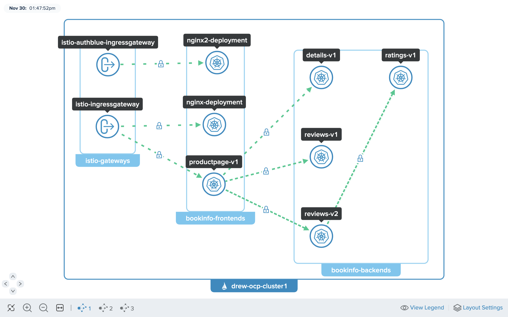

# Accessing multiple applications via multiple Ingress Gateways



## Install a 2nd Ingress

```bash
export ISTIO_VERSION=1.15.3
export ISTIO_REVISION=1-15
export ISTIO_MINOR_VERSION=1.15
# HUB for the Istio Version
# https://support.solo.io/hc/en-us/articles/4414409064596
export HUB="Please update based on above URL"
curl -L https://istio.io/downloadIstio | sh -
```

```bash
helm --kube-context=${CLUSTER1} upgrade --install istio-authblue-ingressgateway ./istio-${ISTIO_VERSION}/manifests/charts/gateways/istio-ingress -n istio-gateways --values - <<EOF
global:
  hub: ${HUB}
  tag: ${ISTIO_VERSION}-solo
gateways:
  istio-ingressgateway:
    name: istio-authblue-ingressgateway
    namespace: istio-gateways
    labels:
# ---- Would be used by VirtualGateway later ----
      istio: authblueingressgateway
    injectionTemplate: gateway
    ports:
    - name: http2
      port: 80
      targetPort: 8080
    - name: https
      port: 443
      targetPort: 8443
EOF
```

## Deploy `nginx2`
```bash
kubectl apply --context ${CLUSTER1} -f- <<EOF
apiVersion: v1
kind: ServiceAccount
metadata:
  name: nginx2
  namespace: bookinfo-frontends
  labels:
    account: nginx2
---
apiVersion: v1
kind: Service
metadata:
  name: nginx2
  namespace: bookinfo-frontends
  labels:
    app: nginx2
spec:
  selector:
    app: nginx2
  ports:
  - name: http
    port: 80
    protocol: TCP
    targetPort: 80
---
apiVersion: apps/v1
kind: Deployment
metadata:
  name: nginx2-deployment
  namespace: bookinfo-frontends
spec:
  selector:
    matchLabels:
      app: nginx2
  replicas: 1
  template:
    metadata:
      labels:
        app: nginx2
    spec:
      serviceAccount: nginx2
      serviceAccountName: nginx2
      containers:
      - name: nginx2
        image: nginx:1.14.2
        ports:
        - containerPort: 80
EOF
```

## Edit `WorkspaceSettings` and export `nginx2`
> to make it visible to whoever is importing

```bash
kubectl apply --context ${MGMT} -f- <<EOF
apiVersion: admin.gloo.solo.io/v2
kind: WorkspaceSettings
metadata:
  name: bookinfo
  namespace: bookinfo-config
spec:
  importFrom:
  - workspaces:
    - name: gateways
    resources:
    - kind: SERVICE
  exportTo:
  - workspaces:
    - name: gateways
    resources:
    - kind: SERVICE
      labels:
        app: productpage
    - kind: SERVICE
      labels:
        app: reviews
    - kind: SERVICE
      labels:
        app: nginx
# ----- exporting nginx2 SERVICE -----
    - kind: SERVICE
      labels:
        app: nginx2
# -----------------------------------
    - kind: ALL
      labels:
        expose: "true"
EOF
```

## Create the `RouteTable`

```bash
kubectl apply --context ${MGMT} -f- <<EOF
apiVersion: networking.gloo.solo.io/v2
kind: RouteTable
metadata:
  name: nginx2
  namespace: bookinfo-config
  labels:
    expose: "true"
#----- Would be using this label as a selector in VirtualGateway -----
    ingress-via: 'istio-authblue-ingressgateway'
spec:
  hosts:
    - '*'
  virtualGateways:
    - name: north-south-authblue-gw
      namespace: gateways-config
      cluster: ${MGMT}
  workloadSelectors: []
  http:
    - name: nginx2
      forwardTo:
        destinations:
          - ref:
              name: nginx2
              namespace: bookinfo-frontends
            port:
              number: 80
---
apiVersion: networking.gloo.solo.io/v2
kind: VirtualGateway
metadata:
  name: north-south-authblue-gw
  namespace: gateways-config
spec:
  workloads:
    - selector:
        labels:
          istio: authblueingressgateway
        cluster: ${CLUSTER1}
  listeners: 
    - http: {}
      port:
        number: 80
      allowedRouteTables:
        - host: '*'
          selector:
            labels:
              ingress-via: istio-authblue-ingressgateway
EOF
```

## Edit the Existing `RouteTable` and the `VirtualGateway`

```bash
kubectl --context ${MGMT} apply -f - <<EOF
apiVersion: networking.gloo.solo.io/v2
kind: VirtualGateway
metadata:
  name: north-south-gw
  namespace: gateways-config
spec:
  workloads:
    - selector:
        labels:
          istio: ingressgateway
        cluster: ${CLUSTER1}
  listeners: 
    - http: {}
      port:
        number: 80
      allowedRouteTables:
        - host: '*'
          selector:
            labels:
              ingress-via: istio-ingressgateway
EOF

kubectl --context ${MGMT} apply -f - <<EOF
apiVersion: networking.gloo.solo.io/v2
kind: RouteTable
metadata:
  name: nginx
  namespace: bookinfo-config
  labels:
    expose: "true"
    ingress-via: istio-ingressgateway
spec:
  hosts:
    - '*'
  virtualGateways:
    - name: north-south-gw
      namespace: gateways-config
      cluster: ${MGMT}
  workloadSelectors: []
  http:
    - name: nginx
      forwardTo:
        destinations:
          - ref:
              name: nginx
              namespace: bookinfo-frontends
            port:
              number: 80
EOF

kubectl --context ${MGMT} apply -f - <<EOF
apiVersion: networking.gloo.solo.io/v2
kind: RouteTable
metadata:
  name: productpage
  namespace: bookinfo-config
  labels:
    expose: "true"
    ingress-via: istio-ingressgateway
spec:
  hosts:
    - '*'
  virtualGateways:
    - name: north-south-gw
      namespace: gateways-config
      cluster: ${MGMT}
  workloadSelectors: []
  http:
    - name: productpage
      matchers:
      - uri:
          exact: /productpage
      - uri:
          prefix: /static
      - uri:
          exact: /login
      - uri:
          exact: /logout
      - uri:
          prefix: /api/v1/products
      forwardTo:
        destinations:
          - ref:
              name: productpage
              namespace: bookinfo-frontends
            port:
              number: 9080
EOF
```

## Test the routes

For istio-ingressgateway:
```bash
export ENDPOINT_HTTP_GW_CLUSTER1=$(kubectl --context ${CLUSTER1} -n istio-gateways get svc istio-ingressgateway -o jsonpath='{.status.loadBalancer.ingress[0].*}'):80

# should take you to nginx
echo "http://${ENDPOINT_HTTP_GW_CLUSTER1}"

# should take you to productpage
echo "http://${ENDPOINT_HTTP_GW_CLUSTER1}/productpage"
```

For istio-authblue-ingressgateway:
```bash
export ENDPOINT2_HTTP_GW_CLUSTER1=$(kubectl --context ${CLUSTER1} -n istio-gateways get svc istio-authblue-ingressgateway -o jsonpath='{.status.loadBalancer.ingress[0].*}'):80

# should take you to nginx2
echo "http://${ENDPOINT2_HTTP_GW_CLUSTER1}"
```
