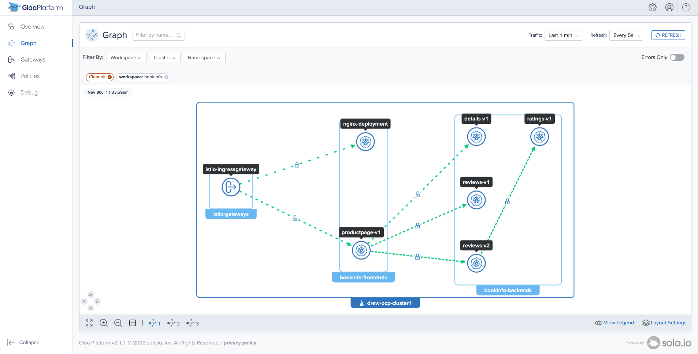

# Simple access test

## Deploy `nginx` in `bookinfo-frontends` in Cluster 1

```bash
kubectl apply --context ${CLUSTER1} -f- <<EOF
apiVersion: v1
kind: ServiceAccount
metadata:
  name: nginx
  namespace: bookinfo-frontends
  labels:
    account: nginx
---
apiVersion: v1
kind: Service
metadata:
  name: nginx
  namespace: bookinfo-frontends
  labels:
    app: nginx
spec:
  selector:
    app: nginx
  ports:
  - name: http
    port: 80
    protocol: TCP
    targetPort: 80
---
apiVersion: apps/v1
kind: Deployment
metadata:
  name: nginx-deployment
  namespace: bookinfo-frontends
spec:
  selector:
    matchLabels:
      app: nginx
  replicas: 1
  template:
    metadata:
      labels:
        app: nginx
    spec:
      serviceAccount: nginx
      serviceAccountName: nginx
      containers:
      - name: nginx
        image: nginx:1.14.2
        ports:
        - containerPort: 80
EOF
```

### verify that `nginx` got deployed

```bash
kubectl --context ${CLUSTER1} -n bookinfo-frontends
  rollout status deploy/nginx-deployment;
```

## Edit `WorkspaceSettings` of the associated `Workspace` objects

- Add a section in `exportTo` in `bookinfo-config` to export the nginx service.
- Ensure that we have a corresponding `importFrom` section in the workspace where the Istio Ingress is running.

```bash
kubectl apply --context ${MGMT} -f- <<EOF
apiVersion: admin.gloo.solo.io/v2
kind: WorkspaceSettings
metadata:
  name: bookinfo
  namespace: bookinfo-config
spec:
  importFrom:
  - workspaces:
    - name: gateways
    resources:
    - kind: SERVICE
  exportTo:
  - workspaces:
    - name: gateways
    resources:
    - kind: SERVICE
      labels:
        app: productpage
    - kind: SERVICE
      labels:
        app: reviews
# ----- exporting nginx SERVICE -----
    - kind: SERVICE
      labels:
        app: nginx
# -----------------------------------
    - kind: ALL
      labels:
        expose: "true"
EOF
```

## Create a `VirtualGateway`

```bash
kubectl --context ${MGMT} apply -f - <<EOF
apiVersion: networking.gloo.solo.io/v2
kind: VirtualGateway
metadata:
  name: north-south-gw
  namespace: gateways-config
spec:
  workloads:
    - selector:
        labels:
          istio: ingressgateway
        cluster: ${CLUSTER1}
  listeners: 
    - http: {}
      port:
        number: 80
      allowedRouteTables:
        - host: '*'
EOF
```

## Create a RouteTable
```bash
kubectl --context ${MGMT} apply -f - <<EOF
apiVersion: networking.gloo.solo.io/v2
kind: RouteTable
metadata:
  name: nginx
  namespace: bookinfo-config
  labels:
    expose: "true"
spec:
  hosts:
    - '*'
  virtualGateways:
    - name: north-south-gw
      namespace: gateways-config
      cluster: ${MGMT}
  workloadSelectors: []
  http:
    - name: nginx
      forwardTo:
        destinations:
          - ref:
              name: nginx
              namespace: bookinfo-frontends
            port:
              number: 80
EOF
```

## Test the route
```bash
echo "http://${ENDPOINT_HTTP_GW_CLUSTER1}"
```

