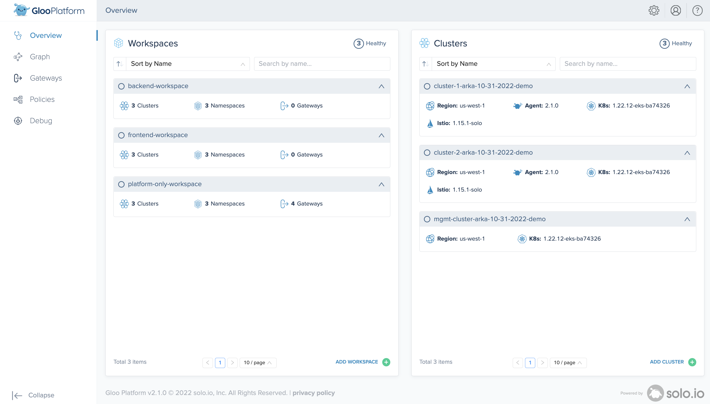
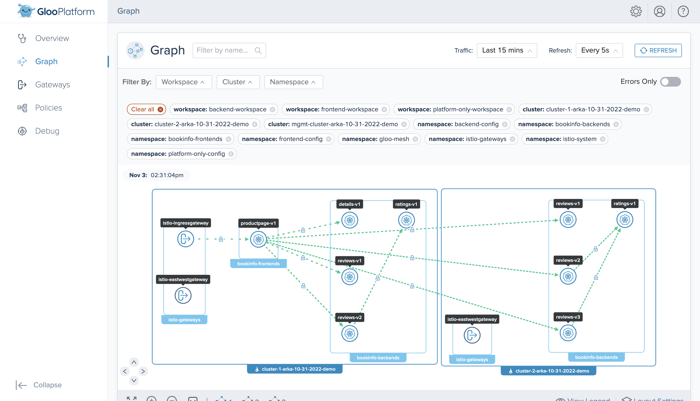
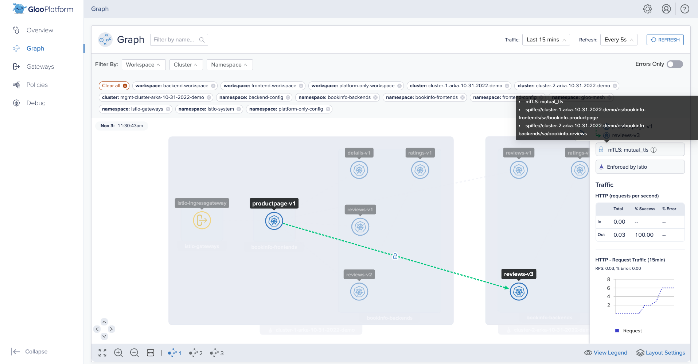
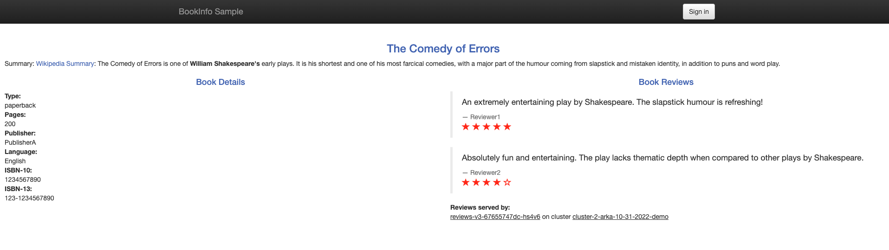

> The following example configuration notes are created based on the [blog](https://github.com/solo-io/solo-cop/tree/main/blogs/workspaces) in the Solo Community of Practices repository.

## `Workspace` & `WorkspaceSettings` objects

1. platform-only-workspace
2. frontend-workspace
3. backend-workspace

## Corresponding Namespaces

### Within `platform-only-workspace`
- platform-only-config (Would contain Gloo Mesh configuration files i.e. `WorkspaceSettings/VirtualGateways/RouteTables/Policies` etc.)
- istio-gateways
- gloo-mesh-addons

### Within `frontend-workspace`
- frontend-config (Would contain Gloo Mesh configuration files i.e. `WorkspaceSettings/VirtualGateways/RouteTables/Policies` etc.)
- bookinfo-frontends

### Within `backend-workspace`
- backend-config (Would contain Gloo Mesh configuration files i.e. `WorkspaceSettings/VirtualGateways/RouteTables/Policies` etc.)
- bookinfo-backends

## Create Workspaces

### platform-only-workspace
```bash
kubectl --context ${MGMT_CONTEXT} create namespace "platform-only-config";

kubectl apply --context ${MGMT_CONTEXT} -f- <<EOF
apiVersion: admin.gloo.solo.io/v2
kind: Workspace
metadata:
  name: platform-only-workspace
  namespace: gloo-mesh
spec:
  workloadClusters:
  - name: ${MGMT_CLUSTER}
    namespaces:
    - name: platform-only-config
    configEnabled: true
  - name: '*'
    namespaces:
    - name: 'istio-gateways'
    - name: 'gloo-mesh-addons'
    configEnabled: false
EOF
```

### frontend-workspace
```bash
kubectl --context ${MGMT_CONTEXT} create namespace "frontend-config";

kubectl apply --context ${MGMT_CONTEXT} -f- <<EOF
apiVersion: admin.gloo.solo.io/v2
kind: Workspace
metadata:
  name: frontend-workspace
  namespace: gloo-mesh
spec:
  workloadClusters:
  - name: ${MGMT_CLUSTER}
    namespaces:
    - name: frontend-config
    configEnabled: true
  - name: '*'
    namespaces:
    - name: 'bookinfo-frontends'
    configEnabled: false
EOF
```

### backend-workspace
```bash
kubectl --context ${MGMT_CONTEXT} create namespace "backend-config";
kubectl apply --context ${MGMT_CONTEXT} -f- <<EOF
apiVersion: admin.gloo.solo.io/v2
kind: Workspace
metadata:
  name: backend-workspace
  namespace: gloo-mesh
spec:
  workloadClusters:
  - name: ${MGMT_CLUSTER}
    namespaces:
    - name: backend-config
    configEnabled: true
  - name: '*'
    namespaces:
    - name: 'bookinfo-backends'
    configEnabled: false
EOF
```

## Create WorkspaceSettings

### platform-only-workspace
```bash
kubectl apply --context ${MGMT_CONTEXT} -f- <<EOF
apiVersion: admin.gloo.solo.io/v2
kind: WorkspaceSettings
metadata:
  name: platform-only-workspace
  namespace: platform-only-config
spec:
  importFrom:
  - workspaces:
    - name: frontend-workspace
  exportTo:
  - workspaces:
    - name: "*"
    resources:
    - kind: SERVICE
      namespace: gloo-mesh-addons
    - kind: VIRTUAL_DESTINATION
      namespace: gloo-mesh-addons
  options:
    federation:
      enabled: false
    eastWestGateways:
    - selector:
        labels:
          istio: eastwestgateway
    serviceIsolation:
      enabled: true
      trimProxyConfig: true
EOF
```

### frontend-workspace
```bash
kubectl apply --context ${MGMT_CONTEXT} -f- <<EOF
apiVersion: admin.gloo.solo.io/v2
kind: WorkspaceSettings
metadata:
  name: frontend-workspace
  namespace: frontend-config
spec:
  importFrom:
  - workspaces:
    - name: backend-workspace
  - workspaces:
    - name: platform-only-workspace    # in case we decide to use the Services from addons ext auth etc.
  exportTo:
  - workspaces:
    - name: platform-only-workspace
  options:
    eastWestGateways:
    - selector:
        labels:
          istio: eastwestgateway
    federation:
      enabled: false
    serviceIsolation:
      enabled: true
      trimProxyConfig: true
EOF
```

### backend-workspace
```bash
kubectl apply --context ${MGMT_CONTEXT} -f- <<EOF
apiVersion: admin.gloo.solo.io/v2
kind: WorkspaceSettings
metadata:
  name: backend-workspace
  namespace: backend-config
spec:
  exportTo:
  - workspaces:
    - name: frontend-workspace
  importFrom:
  - workspaces:
    - name: platform-only-workspace    # in case we decide to use the Services from addons ext auth etc.
  options:
    eastWestGateways:
    - selector:
        labels:
          istio: eastwestgateway
    federation:
      enabled: false
    serviceIsolation:
      enabled: true
      trimProxyConfig: true
EOF
```

> After creating the above `Workspace` and `WorkspaceSettings` objects, Gloo Mesh UI dashboard should look like the following-



## Virtual Gateway
```bash
kubectl --context ${MGMT_CONTEXT} apply -f - <<EOF
apiVersion: networking.gloo.solo.io/v2
kind: VirtualGateway
metadata:
  name: north-south-gw
  namespace: platform-only-config
spec:
  workloads:
    - selector:
        labels:
          istio: ingressgateway
        cluster: ${REMOTE_CLUSTER1}
  listeners: 
    - http: {}
      port:
        number: 80
      allowedRouteTables:
        - host: '*'
EOF
```

## RouteTable
```bash
kubectl --context ${MGMT_CONTEXT} apply -f - <<EOF
apiVersion: networking.gloo.solo.io/v2
kind: RouteTable
metadata:
  name: productpage
  namespace: frontend-config
spec:
  hosts:
    - '*'
  virtualGateways:
    - name: north-south-gw
      namespace: platform-only-config
      cluster: ${MGMT_CLUSTER}
  workloadSelectors: []
  http:
    - name: productpage
      matchers:
      - uri:
          exact: /productpage
      - uri:
          prefix: /static
      - uri:
          exact: /login
      - uri:
          exact: /logout
      - uri:
          prefix: /api/v1/products
      forwardTo:
        destinations:
          - ref:
              name: productpage
              namespace: bookinfo-frontends
            port:
              number: 9080
EOF
```

## Multi cluster routing using `VirtualDestination`
```bash
kubectl --context ${MGMT_CONTEXT} apply -f - <<EOF
apiVersion: networking.gloo.solo.io/v2
kind: VirtualDestination
metadata:
  name: reviews
  namespace: backend-config
spec:
  hosts:
  - 'reviews.global'
  services:
  - labels:
      app: reviews
  ports:
  - number: 9080
    protocol: HTTP
EOF
```

## Edit the REVIEWS_HOSTNAME env value to use the VirtualDestination
```bash
kubectl --context ${REMOTE_CONTEXT1} -n bookinfo-frontends \
    set env deploy/productpage-v1 \
    REVIEWS_HOSTNAME="reviews.global"

kubectl --context ${REMOTE_CONTEXT2} -n bookinfo-frontends \
    set env deploy/productpage-v1 \
    REVIEWS_HOSTNAME="reviews.global"
```

## Verify

```bash
export ENDPOINT_HTTP_GW_CLUSTER1=$(kubectl --context ${REMOTE_CONTEXT1} -n istio-gateways get svc istio-ingressgateway -o jsonpath='{.status.loadBalancer.ingress[0].*}'):80
open "http://${ENDPOINT_HTTP_GW_CLUSTER1}/productpage"
```

### logs from east-west gateway
```bash
kubectl --context ${REMOTE_CONTEXT2} -n istio-gateways logs -f deploy/istio-eastwestgateway
```

```bash
[2022-11-03T18:22:51.440Z] "- - -" 0 - - - "-" 12184 17251 59279 - "-" "-" "-" "-" "172.16.0.60:9080" outbound_.9080_._.reviews.global 172.16.1.139:40738 172.16.1.139:15443 172.16.0.74:64843 outbound_.9080_._.reviews.global -
[2022-11-03T18:22:57.722Z] "- - -" 0 - - - "-" 12184 17257 59959 - "-" "-" "-" "-" "172.16.1.182:9080" outbound_.9080_._.reviews.global 172.16.1.139:36108 172.16.1.139:15443 172.16.1.203:49383 outbound_.9080_._.reviews.global -
```
### Weight based routing notes
```bash
cat << EOF | kubectl --context ${MGMT_CONTEXT} apply -f -
apiVersion: networking.gloo.solo.io/v2
kind: RouteTable
metadata:
  name: reviews
  namespace: backend-config
spec:
  hosts:
    - 'reviews.global'
  http:
    # Route for the reviews service
    - name: reviews
      # Prefix matching
      matchers:
      - uri:
          prefix: /
      # Forwarding directive
      forwardTo:
        destinations:
          - kind: VIRTUAL_DESTINATION
            ref:
              name: reviews
              namespace: backend-config
              cluster: ${MGMT_CONTEXT}
            subset:
              version: v1
            port:
              number: 9080
            weight: 100
          - kind: VIRTUAL_DESTINATION
            ref:
              name: reviews
              namespace: backend-config
              cluster: ${MGMT_CONTEXT}
            subset:
              version: v3
            port:
              number: 9080
            weight: 0
EOF
```

#### verify
```bash
for i in {1..20}
do
   curl -s http://${ENDPOINT_HTTP_GW_CLUSTER1}/productpage | grep "reviews-"
done
```
# Access on HTTPS endpoint

```bash
cat << EOF | kubectl apply --context ${REMOTE_CONTEXT1} -f -
kind: Certificate
apiVersion: cert-manager.io/v1
metadata:
  name: certificate-north-south-gw-${REMOTE_CLUSTER1}
  namespace: istio-gateways
spec:
  commonName: north-south-gw
  dnsNames:
    - "*.arka.gl00.net"
  # test duration
  duration: 16h
  issuerRef:
# ---------------- Issuer for Istio CA ---------------------------
    group: awspca.cert-manager.io
    kind: AWSPCAClusterIssuer
    name: aws-pca-cluster-issuer-istio-${REMOTE_CONTEXT1}
# ---------------- Issuer for Istio CA ---------------------------
  renewBefore: 1h
  secretName: tls-secret-north-south-gw-${REMOTE_CLUSTER1}
  usages:
    - server auth
    - client auth
  privateKey:
    algorithm: "RSA"
    size: 2048
EOF
```

## verify cert creation
```bash
kubectl --context ${REMOTE_CONTEXT1} \
  -n istio-gateways \
  get certificate \
  certificate-north-south-gw-${REMOTE_CLUSTER1}
```
> Success message-
```bash
NAME                                                        READY   SECRET                                                     AGE
certificate-north-south-gw-cluster-1-arka-10-31-2022-demo   True    tls-secret-north-south-gw-cluster-1-arka-10-31-2022-demo   34s
```

## verify the secret
```bash
kubectl --context ${REMOTE_CONTEXT1} \
  -n istio-gateways \
  get secret tls-secret-north-south-gw-${REMOTE_CLUSTER1}
```

```bash
NAME                                                       TYPE                DATA   AGE
tls-secret-north-south-gw-cluster-1-arka-10-31-2022-demo   kubernetes.io/tls   3      97s
```

## Edit Virtual Gateway
```bash
kubectl --context ${MGMT_CONTEXT} apply -f - <<EOF
apiVersion: networking.gloo.solo.io/v2
kind: VirtualGateway
metadata:
  name: north-south-gw
  namespace: platform-only-config
spec:
  workloads:
    - selector:
        labels:
          istio: ingressgateway
        cluster: ${REMOTE_CLUSTER1}
  listeners:
    - http: {}
# ---------------- SSL config ---------------------------
      port:
        number: 443
      tls:
        mode: SIMPLE
        secretName: tls-secret-north-south-gw-${REMOTE_CLUSTER1}
# -------------------------------------------------------
      allowedRouteTables:
        - host: 'bookinfo.arka.gl00.net'
EOF
```

> Have created a Route53 record `bookinfo.arka.gl00.net` pointing to the Istio Ingress LoadBalancer.

### Edited RouteTable with updated host
```bash
kubectl --context ${MGMT_CONTEXT} apply -f - <<EOF
apiVersion: networking.gloo.solo.io/v2
kind: RouteTable
metadata:
  name: productpage
  namespace: frontend-config
spec:
# ---------------- host ---------------------------
  hosts:
    - 'bookinfo.arka.gl00.net'
# ---------------- host ---------------------------
  virtualGateways:
    - name: north-south-gw
      namespace: platform-only-config
      cluster: ${MGMT_CLUSTER}
  workloadSelectors: []
  http:
    - name: productpage
      matchers:
      - uri:
          exact: /productpage
      - uri:
          prefix: /static
      - uri:
          exact: /login
      - uri:
          exact: /logout
      - uri:
          prefix: /api/v1/products
      forwardTo:
        destinations:
          - ref:
              name: productpage
              namespace: bookinfo-frontends
            port:
              number: 9080
EOF
```

## verify
```bash
open https://bookinfo.arka.gl00.net/productpage
```

### Screenshots







# Multicluster Routing with `productpage`

Create a VirtualDestination for `productpage` (Creates the `ServiceEntry` for "productpage.global")
```bash
kubectl --context ${MGMT_CONTEXT} apply -f - <<EOF
apiVersion: networking.gloo.solo.io/v2
kind: VirtualDestination
metadata:
  name: productpage
  namespace: frontend-config
spec:
  hosts:
  - productpage.global
  services:
  - namespace: bookinfo-frontends
    labels:
      app: productpage
  ports:
    - number: 9080
      protocol: HTTP
EOF
```

Edit the existing routetable so that the Virtual destination is used.
```bash
kubectl --context ${MGMT_CONTEXT} apply -f - <<EOF
apiVersion: networking.gloo.solo.io/v2
kind: RouteTable
metadata:
  name: productpage
  namespace: frontend-config
spec:
  hosts:
    - 'bookinfo.arka.gl00.net'
  virtualGateways:
    - name: north-south-gw
      namespace: platform-only-config
      cluster: ${MGMT_CLUSTER}
  workloadSelectors: []
  http:
    - name: productpage
      matchers:
      - uri:
          exact: /productpage
      - uri:
          prefix: /static
      - uri:
          exact: /login
      - uri:
          exact: /logout
      - uri:
          prefix: /api/v1/products
      forwardTo:
        destinations:
# ---------------- Forward to VirtualDestination change start ---------------------------
# ---------------- Previous dest-> name: productpage namespace: bookinfo-frontends ---------------------------
          - ref:
              name: productpage
              namespace: frontend-config
            kind: VIRTUAL_DESTINATION
# ---------------- Forward to VirtualDestination change end ---------------------------
            port:
              number: 9080
EOF
```

## Weighted routing with subsets and VirtualDestination

### Deploy productpage v2 in cluster 2

```bash
kubectl -n bookinfo-frontends --context ${REMOTE_CONTEXT2} apply -f - <<EOF
apiVersion: apps/v1
kind: Deployment
metadata:
  name: productpage-v2
  labels:
    app: productpage
    version: v2
spec:
  replicas: 1
  selector:
    matchLabels:
      app: productpage
      version: v2
  template:
    metadata:
      labels:
        app: productpage
        version: v2
    spec:
      serviceAccountName: bookinfo-productpage
      containers:
      - name: productpage
        image: docker.io/istio/examples-bookinfo-productpage-v1:1.17.0
        imagePullPolicy: IfNotPresent
        ports:
        - containerPort: 9080
        volumeMounts:
        - name: tmp
          mountPath: /tmp
        securityContext:
          runAsUser: 1000
      volumes:
      - name: tmp
        emptyDir: {}
EOF
```

- Edit the env vars so that the above product page version can interact with the already running reviews and details services
```bash
kubectl --context ${REMOTE_CONTEXT2} -n bookinfo-frontends \
  set env deploy/productpage-v2 \
  REVIEWS_HOSTNAME="reviews.global";

kubectl --context "${REMOTE_CONTEXT2}" -n bookinfo-frontends \
  set env deploy/productpage-v2 \
  DETAILS_HOSTNAME="details.bookinfo-backends.svc.cluster.local";
```

- Create the productpage VirtualDestination
```bash
kubectl --context ${MGMT_CONTEXT} apply -f - <<EOF
apiVersion: networking.gloo.solo.io/v2
kind: VirtualDestination
metadata:
  name: productpage
  namespace: frontend-config
spec:
  hosts:
  - productpage.global
  services:
  - namespace: bookinfo-frontends
    labels:
      app: productpage
  ports:
    - number: 9080
      protocol: HTTP
EOF
```

- Create the productpage Routetable and defined weighted routing
```bash
kubectl --context ${MGMT_CONTEXT} apply -f - <<EOF
apiVersion: networking.gloo.solo.io/v2
kind: RouteTable
metadata:
  name: productpage
  namespace: frontend-config
spec:
  hosts:
    - '*'
  virtualGateways:
    - name: north-south-gw
      namespace: platform-config
      cluster: ${MGMT_CONTEXT}
  workloadSelectors: []
  http:
    - name: productpage
      matchers:
      - uri:
          exact: /productpage
      - uri:
          prefix: /static
      - uri:
          exact: /login
      - uri:
          exact: /logout
      - uri:
          prefix: /api/v1/products
      forwardTo:
        destinations:
          - kind: VIRTUAL_DESTINATION
            ref:
              name: productpage
              namespace: frontend-config
            port:
              number: 9080
            subset:
              version: v1
            weight: 50
          - kind: VIRTUAL_DESTINATION
            ref:
              name: productpage
              namespace: frontend-config
            port:
              number: 9080
            subset:
              version: v2
            weight: 50
EOF
```

- Follow logs of productpage v2
```bash
kubectl --context ${REMOTE_CONTEXT2} -n bookinfo-frontends \
  logs -f deploy/productpage-v2;
```

- Follow logs of productpage v1
```bash
kubectl --context ${REMOTE_CONTEXT1} -n bookinfo-frontends \
  logs -f deploy/productpage-v1;
```

```bash
kubectl --context ${REMOTE_CONTEXT2} -n bookinfo-frontends \
  logs -f deploy/productpage-v1;
```

- Attempt curl
```bash
export ENDPOINT_HTTP_GW_CLUSTER1=$(kubectl --context ${REMOTE_CONTEXT1} -n istio-gateways get svc istio-ingressgateway -o jsonpath='{.status.loadBalancer.ingress[0].*}'):80

echo; echo "Productpage link: http://${ENDPOINT_HTTP_GW_CLUSTER1}/productpage"

for i in {1..20}
do
  echo; echo "Attempt ${i}:";
  OUTPUT=$(curl -s "http://${ENDPOINT_HTTP_GW_CLUSTER1}/productpage" | grep -A3 "reviews-")
  echo; echo $OUTPUT
done
```

# Failover with `productpage`

- Add `failover: "true"` label to the `VirtualDestination`. This label would be used as a selector later.
```bash
kubectl --context ${MGMT_CONTEXT} apply -f - <<EOF
apiVersion: networking.gloo.solo.io/v2
kind: VirtualDestination
metadata:
  name: productpage
  namespace: frontend-config
# ---------------- Add label ---------------------------
  labels:
    failover: "true"
# ---------------- Add label ---------------------------
spec:
  hosts:
  - productpage.global
  services:
  - namespace: bookinfo-frontends
    labels:
      app: productpage
  ports:
    - number: 9080
      protocol: HTTP
EOF
```

- Create the FailoverPolicy
```bash
kubectl --context ${MGMT_CONTEXT} apply -f - <<EOF
apiVersion: resilience.policy.gloo.solo.io/v2
kind: FailoverPolicy
metadata:
  name: failover-productpage
  namespace: frontend-config
spec:
  applyToDestinations:
  - kind: VIRTUAL_DESTINATION
    selector:
      labels:
        failover: "true"
  config:
    localityMappings: []
EOF
```

- Create the OutlierDetectionPolicy to define the configuration for when the failover should happen
```bash
kubectl --context ${MGMT_CONTEXT} apply -f - <<EOF
apiVersion: resilience.policy.gloo.solo.io/v2
kind: OutlierDetectionPolicy
metadata:
  name: outlier-detection-productpage
  namespace: frontend-config
spec:
  applyToDestinations:
  - kind: VIRTUAL_DESTINATION
    selector:
      labels:
        failover: "true"
  config:
    consecutiveErrors: 2
    interval: 5s
    baseEjectionTime: 30s
    maxEjectionPercent: 100
EOF
```

- Reduce the replicacount of the productpage-v1 - deployment in workload cluster 1 to test that the failover to cluster 2 is working-
```bash
kubectl --context ${REMOTE_CONTEXT1} -n bookinfo-frontends scale deploy/productpage-v1 --replicas=0
kubectl --context ${REMOTE_CONTEXT1} -n bookinfo-frontends wait --for=jsonpath='{.spec.replicas}'=0 deploy/productpage-v1
```

- Follow logs of productpage running in cluster 2-
```bash
kubectl --context ${REMOTE_CONTEXT2} -n bookinfo-frontends logs -f -l "app=productpage"
```

- Try accessing the application:
```bash
for i in {1..20}
do
  echo; echo "Attempt ${i}:";
  OUTPUT=$(curl -s "http://${ENDPOINT_HTTP_GW_CLUSTER1}/productpage" | grep -A3 "reviews-")
  echo $OUTPUT
done
```

# External service access via CIDR and IP test notes
#### create a NameSpace in the workload cluster and add `istio.io/rev` label:
```bash
kubectl --context="${REMOTE_CONTEXT1}" create ns bookinfo;
kubectl --context="${REMOTE_CONTEXT1}" label namespace bookinfo "istio.io/rev"="1-15"
```
#### create the config NameSpace in the management cluster
```bash
kubectl --context="${MGMT_CONTEXT}" create ns bookinfo-config;
````

#### deploy sleep pod in workload cluster
```bash
cat << EOF | kubectl -n bookinfo --context=${REMOTE_CONTEXT1} apply -f -
apiVersion: v1
kind: ServiceAccount
metadata:
  name: sleep
---
apiVersion: v1
kind: Service
metadata:
  name: sleep
  labels:
    app: sleep
    service: sleep
spec:
  ports:
  - port: 80
    name: http
  selector:
    app: sleep
---
apiVersion: apps/v1
kind: Deployment
metadata:
  name: sleep
spec:
  replicas: 1
  selector:
    matchLabels:
      app: sleep
  template:
    metadata:
      labels:
        app: sleep
    spec:
      serviceAccountName: sleep
      containers:
      - name: sleep
        image: governmentpaas/curl-ssl:terraform-14
        command: ["/bin/sleep", "3650d"]
        imagePullPolicy: IfNotPresent
        volumeMounts:
        - mountPath: /etc/sleep/tls
          name: secret-volume
      volumes:
      - name: secret-volume
        secret:
          secretName: sleep-secret
          optional: true
EOF
```

#### test that external svc access is NOT working by default, due to `REGISTRY_ONLY` outbound traffic policy

Attempting to access https://httpbin.org by it's IP address.

```bash
for IP in $(dig +short httpbin.org); do
  kubectl --context=${REMOTE_CONTEXT1} -n bookinfo exec -ti deploy/sleep -c sleep -- curl -ik https://$IP/get
done
```

Output:
```bash
curl: (35) OpenSSL SSL_connect: SSL_ERROR_SYSCALL in connection to 52.1.93.201:443
command terminated with exit code 35
curl: (35) OpenSSL SSL_connect: SSL_ERROR_SYSCALL in connection to 34.205.150.168:443
command terminated with exit code 35
curl: (35) OpenSSL SSL_connect: SSL_ERROR_SYSCALL in connection to 52.200.117.68:443
command terminated with exit code 35
curl: (35) OpenSSL SSL_connect: SSL_ERROR_SYSCALL in connection to 34.224.50.110:443
command terminated with exit code 35
```

##### create the `Workspace`, `WorkspaceSettings` in management cluster

```bash
kubectl --context="${MGMT_CONTEXT}" apply -f- <<EOF
apiVersion: admin.gloo.solo.io/v2
kind: Workspace
metadata:
  name: bookinfo
  namespace: gloo-mesh
spec:
  workloadClusters:
  - name: "${MGMT_CONTEXT}"
    namespaces:
    - name: bookinfo-config
    configEnabled: true
  - name: "${REMOTE_CONTEXT1}"
    namespaces:
    - name: bookinfo
    configEnabled: false
---
apiVersion: admin.gloo.solo.io/v2
kind: WorkspaceSettings
metadata:
  name: bookinfo
  namespace: bookinfo-config
spec:
  options:
    eastWestGateways:
    - selector:
        labels:
          istio: eastwestgateway
    federation:
      enabled: false
    serviceIsolation:
      enabled: true
      trimProxyConfig: true
EOF
```

#### Test that ext svc access is STILL not working

```bash
for IP in $(dig +short httpbin.org); do
  kubectl --context=${REMOTE_CONTEXT1} -n bookinfo exec -ti deploy/sleep -c sleep -- curl -ik https://$IP/get
done
```

Output:
```bash
curl: (35) OpenSSL SSL_connect: SSL_ERROR_SYSCALL in connection to 52.1.93.201:443
command terminated with exit code 35
curl: (35) OpenSSL SSL_connect: SSL_ERROR_SYSCALL in connection to 34.224.50.110:443
command terminated with exit code 35
curl: (35) OpenSSL SSL_connect: SSL_ERROR_SYSCALL in connection to 52.200.117.68:443
command terminated with exit code 35
curl: (35) OpenSSL SSL_connect: SSL_ERROR_SYSCALL in connection to 34.205.150.168:443
command terminated with exit code 35
```

## create the `ExternalService` with CIDR

- Check the CIDR for httpbin.org

```bash
dig +short httpbin.org
```
```bash
34.224.50.110
34.205.150.168
52.200.117.68
52.1.93.201
```

- CIDR of httpbin.org for this test
```bash
  - 34.0.0.0/8
  - 52.0.0.0/8
```

```bash
kubectl --context=${MGMT_CONTEXT} apply -f- <<EOF
apiVersion: networking.gloo.solo.io/v2
kind: ExternalService
metadata:
  name: httpbin-ext-svc
  namespace: bookinfo-config
spec:
  addresses:
# --- CIDR for httpbin --- 
  - 34.0.0.0/8
  - 52.0.0.0/8
# --- CIDR for httpbin --- 
  ports:
# --- TCP 443 for HTTPS --- 
  - name: tcp
    number: 443
    protocol: TCP
# --- TCP 443 for HTTPS --- 
EOF
```

- This creates the `ServiceEntry` object in the workload cluster.

### Test that access is now working
```bash
for IP in $(dig +short httpbin.org); do
  kubectl --context=${REMOTE_CONTEXT1} -n bookinfo exec -ti deploy/sleep -c sleep -- curl -ik https://$IP/get
done
```

```bash
HTTP/2 200
date: Wed, 01 Feb 2023 16:34:56 GMT
content-type: application/json
content-length: 259
server: gunicorn/19.9.0
access-control-allow-origin: *
access-control-allow-credentials: true
.
.
.
```

#### Delete the `ExternalService` and re-test. It shouldn't work anymore

```bash
kubectl --context=${MGMT_CONTEXT} -n bookinfo-config delete externalservice httpbin-ext-svc
```

```bash
for IP in $(dig +short httpbin.org); do
  kubectl --context=${REMOTE_CONTEXT1} -n bookinfo exec -ti deploy/sleep -c sleep -- curl -ik https://$IP/get
done
```

Output
```bash
curl: (35) OpenSSL SSL_connect: SSL_ERROR_SYSCALL in connection to 52.200.117.68:443
command terminated with exit code 35
curl: (35) OpenSSL SSL_connect: SSL_ERROR_SYSCALL in connection to 34.224.50.110:443
command terminated with exit code 35
curl: (35) OpenSSL SSL_connect: SSL_ERROR_SYSCALL in connection to 52.1.93.201:443
command terminated with exit code 35
curl: (35) OpenSSL SSL_connect: SSL_ERROR_SYSCALL in connection to 34.205.150.168:443
command terminated with exit code 35
```

## create the `ExternalService` with IP address

> pre-req: We ran nginx on an EC2 and the public IP was `3.22.233.162`

```bash
export NGINX_IP="3.22.233.162"
```
### By default access shouldn't work due to REGISTRY_ONLY config

```bash
kubectl --context=${REMOTE_CONTEXT1} -n bookinfo exec -ti deploy/sleep -c sleep -- curl -ik http://$NGINX_IP
```

```bash
Output:
HTTP/1.1 502 Bad Gateway
date: Wed, 01 Feb 2023 16:39:03 GMT
server: envoy
content-length: 0
```

#### ExternalService on HTTP endpoint
```bash
kubectl --context=${MGMT_CONTEXT} apply -f- <<EOF
apiVersion: networking.gloo.solo.io/v2
kind: ExternalService
metadata:
  name: nginx-ec2-ext-svc
  namespace: bookinfo-config
spec:
  addresses:
  - "${NGINX_IP}"
  ports:
  - name: tcp
    number: 80
    protocol: TCP
EOF
```

### Verify access. Expected to work now

```bash
kubectl --context=${REMOTE_CONTEXT1} -n bookinfo exec -ti deploy/sleep -c sleep -- curl -i http://$NGINX_IP
```

#### Output

```bash
HTTP/1.1 200 OK
Server: nginx/1.22.0
Date: Wed, 01 Feb 2023 16:40:38 GMT
Content-Type: text/html
Content-Length: 615
Last-Modified: Fri, 18 Nov 2022 12:30:11 GMT
Connection: keep-alive
ETag: "63777ad3-267"
Accept-Ranges: bytes
.
.
.
```

#### after deleting the ExternalService acess should stop working

```bash
kubectl --context=${MGMT_CONTEXT} -n bookinfo-config delete externalservice nginx-ec2-ext-svc;
```

```bash
kubectl --context=${REMOTE_CONTEXT1} -n bookinfo exec -ti deploy/sleep -c sleep -- curl -i http://$NGINX_IP;
```

Output:
```
HTTP/1.1 502 Bad Gateway
date: Wed, 01 Feb 2023 16:43:35 GMT
server: envoy
content-length: 0
```

#### Accessing an app directly by it's IP on HTTPS

> Pre-req: Enabled TLS for the nginx runing on EC2. [docs](https://www.linode.com/docs/guides/getting-started-with-nginx-part-3-enable-tls-for-https/)

`export NGINX_IP="3.22.233.162"`

#### Access shouldn't work by default

```bash
kubectl --context=${REMOTE_CONTEXT1} -n bookinfo exec -ti deploy/sleep -c sleep -- curl -ik https://$NGINX_IP
```

Output:
```bash
curl: (35) OpenSSL SSL_connect: SSL_ERROR_SYSCALL in connection to 3.22.233.162:443
command terminated with exit code 35
```

#### Create an ExternalService with IP address

> TCP 443 should be the port

```bash
kubectl --context=${MGMT_CONTEXT} apply -f- <<EOF
apiVersion: networking.gloo.solo.io/v2
kind: ExternalService
metadata:
  name: nginx-ec2-ext-svc-https
  namespace: bookinfo-config
spec:
  addresses:
  - "${NGINX_IP}"
  ports:
  - name: tcp
    number: 443
    protocol: TCP
EOF
```

##### Access should work now
```bash
kubectl --context=${REMOTE_CONTEXT1} -n bookinfo exec -ti deploy/sleep -c sleep -- curl -ik https://$NGINX_IP
```

```bash
HTTP/2 200
server: nginx/1.22.0
date: Wed, 01 Feb 2023 17:04:50 GMT
content-type: text/html
content-length: 615
last-modified: Fri, 18 Nov 2022 12:30:11 GMT
etag: "63777ad3-267"
accept-ranges: bytes
```

##### After deleting the `ExternalService` access SHOULD NOT work

```bash
kubectl --context=${MGMT_CONTEXT} -n bookinfo-config delete externalservice nginx-ec2-ext-svc-https;
```

```bash
kubectl --context=${REMOTE_CONTEXT1} -n bookinfo exec -ti deploy/sleep -c sleep -- curl -ik https://$NGINX_IP
```

Output:
```bash
curl: (35) OpenSSL SSL_connect: SSL_ERROR_SYSCALL in connection to 3.22.233.162:443
command terminated with exit code 35
```

#### Directly access ext svc via a hostname

```bash
kubectl apply --context ${MGMT_CONTEXT} -f- <<EOF
apiVersion: networking.gloo.solo.io/v2
kind: ExternalService
metadata:
  name: google-ext-svc
  namespace: bookinfo-config
spec:
  hosts:
  - www.google.com
  ports:
  - name: tcp
    number: 443
    protocol: TCP
EOF
```

```bash
kubectl --context=${REMOTE_CONTEXT1} -n bookinfo exec -ti deploy/sleep -c sleep -- curl -ik https://www.google.com
```
Output-

```bash
HTTP/2 200
date: Wed, 01 Feb 2023 19:10:13 GMT
expires: -1
cache-control: private, max-age=0
content-type: text/html; charset=ISO-8859-1
.
.
.
```
