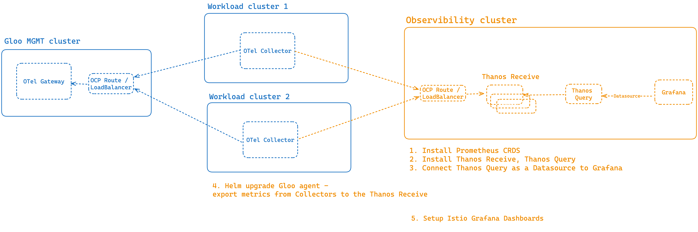

Setup Istio Dashboard for multicluster environment, with the help of Open Telemetry components and Gloo Mesh.

## Overview Diagram


## Steps Overview

1. Install Prometheus CRDS
2. Install Thanos Receive, Thanos Query
3. Connect Thanos Query as a Datasource to Grafana
4. Helm upgrade agent install to export metrics from Collectors to the Thanos Receive
5. Import Istio Dashboards

## Install prometheus CRDs

```bash
helm repo add prometheus-community https://prometheus-community.github.io/helm-charts
helm repo update
helm install prometheus-crds prometheus-community/prometheus-operator-crds
```

## Install Thanos Receive, Thanos Query

Thanos values default:

https://github.com/bitnami/charts/blob/main/bitnami/thanos/values.yaml

Thanos values overrides used in the minimal demo environment:

https://github.com/find-arka/k8s-misc/blob/main/observability-setup-multicluster-notes/values-thanos.yaml

```bash
kubectl create namespace monitoring;

helm upgrade --install -n monitoring \
  thanos oci://registry-1.docker.io/bitnamicharts/thanos \
  --values ./values-thanos.yaml
```

## Gloo Agent 2.2.x additional overrides:

```bash
REMOTE_PORT=$(kubectl -n monitoring get service thanos-receive -o jsonpath='{.spec.ports[?(@.name=="remote")].port}')
echo ${REMOTE_PORT}
```

```yaml
metricscollectorCustomization:
  extraProcessors:
    batch/istiod-thanos:
      send_batch_size: 10000
      timeout: 10s
  extraExporters:
    prometheusremotewrite:
      endpoint: "http://${THANOS_RECEIVE_ENDPOINT}:${REMOTE_PORT}/api/v1/receive"
      tls:
        insecure: true
      external_labels:
        istio-workload-cluster: "${CLUSTER}"
        key: value
  extraPipelines:
    metrics/thanos:
      receivers:
        - prometheus
      processors:
        - memory_limiter
        - batch/istiod-thanos
      exporters:
        - prometheusremotewrite
```

> Note:
If Istio is installed via IstioOperator, we would have to run the following command to patch the configmap for OTel collector

```bash
kubectl get cm gloo-metrics-collector-config -n gloo-mesh -o yaml | sed "s|regex: pilot|regex: istiod|"  > patch.yaml | kubectl apply -f patch.yaml
```

Restart DaemonSet to pick up the above changes:

```bash
kubectl -n gloo-mesh rollout restart daemonset gloo-metrics-collector-agent
```

## Import Istio Dashboards

1. 7639 - https://grafana.com/grafana/dashboards/7639-istio-mesh-dashboard/ (Istio Mesh Dashboard)
2. 11829 - https://grafana.com/grafana/dashboards/11829-istio-performance-dashboard/ (Istio Performance Dashboard)
3. 7636 - https://grafana.com/grafana/dashboards/7636-istio-service-dashboard/ (Istio Service Dashboard)
4. 7630 - https://grafana.com/grafana/dashboards/7630-istio-workload-dashboard/ (Istio Workload Dashboard)
5. 7645 - https://grafana.com/grafana/dashboards/7645-istio-control-plane-dashboard/ (Istio Control Plane Dashboard)
